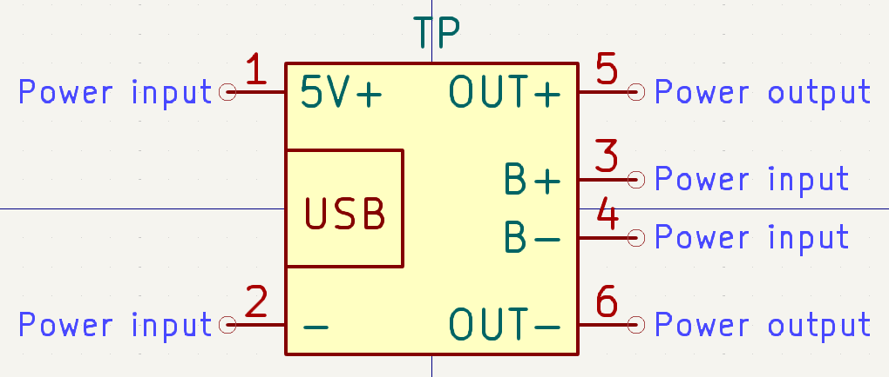
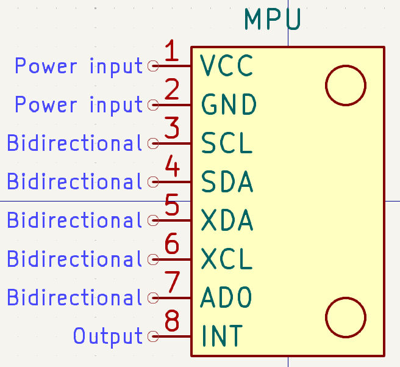
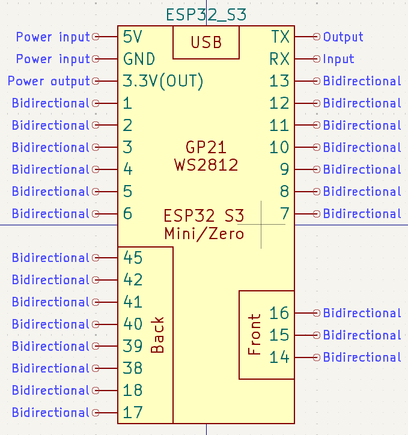

# KiCad-Custom-Parts

Repository to hold custom symbols, footprints, etc created for use in KiCad.

## Parts added

- TP4056 USB Module (Symbol)

- MPU6050 Gyroscope Module (Symbol)

- Waveshare ESP32-S3 Mini/Zero Development Board (Symbol)

https://www.waveshare.com/product/esp32-s3-zero.htm

